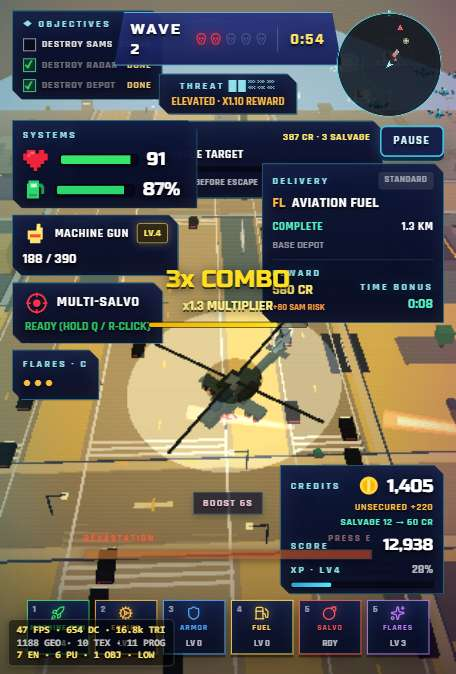
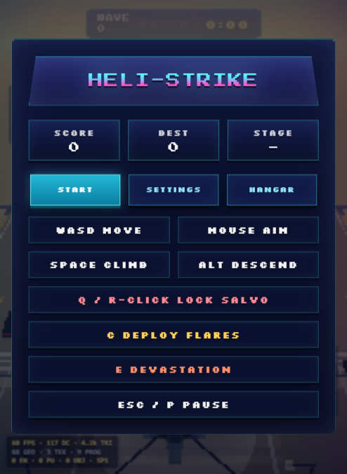
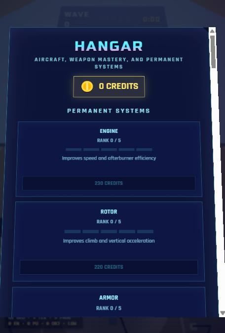
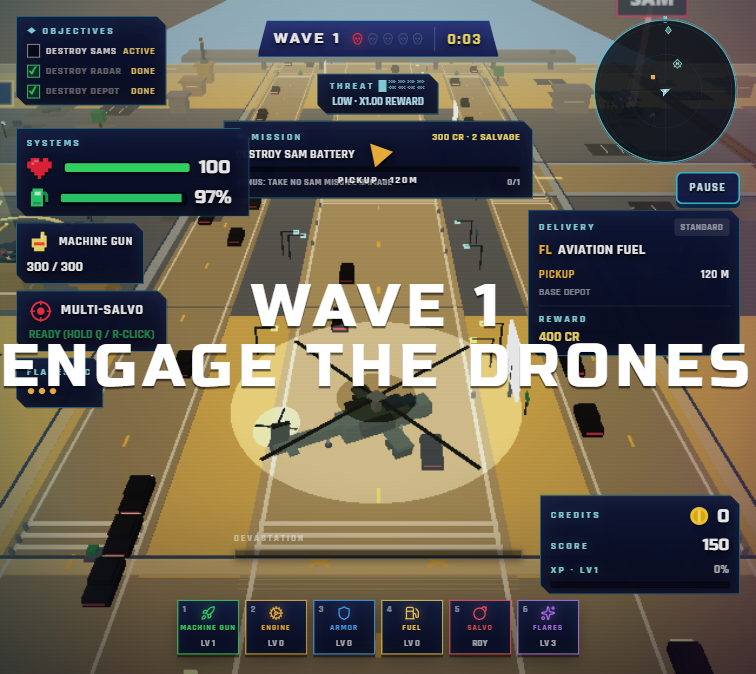

# 🚁 Heli-Strike Arcade Assault



> **A fast-paced 3D low-poly arcade helicopter shooter.** Fly a gunship over a living, procedural desert battlefield — dodge rooftop turrets, raze enemy waves, tear down SAM sites, and topple a three-phase boss. Built with React, Vite, Three.js, and Cannon-es.

## 🖼️ Screenshots

### Main Menu


### Choose Your Gunship — The Hangar


### In-Game HUD — Wave Start


### Combat & Combos


### Boss Battles Every 10th Wave


---

## ⚡ Features

- **Living City** — A wide procedural city streams around you: **traffic that swerves away and honks** when you buzz it, **animated roadside billboards** with scrolling marquee tickers, **rooftop gun turrets** that track and shoot you, pulsing rooftop beacons, and weather that rolls in with rain and lightning.
- **Time-Driven Waves (Vampire-Survivors style)** — Waves advance on a clock, never on clearing the field. Enemies stream in forever, ramping density and spawning from flanks and behind to surround you. Survival time is the real score.
- **Vampire-Survivors Upgrade Loop** — Every enemy you destroy drops an **XP gem**. Fly through gems to fill your run-level bar, and each level-up opens a **pick-1-of-3 upgrade roulette** (damage, fire rate, ammo, shields, and more). Gem value scales with the enemy — bosses are XP jackpots. The curve starts fast (~7 kills to first level) and demands real farming late (30+ kills), so upgrades land deliberately, not constantly.
- **Four Upgradeable Weapons** — Machine Gun, Missile, Rocket, and Shotgun. **Kill with a weapon and it earns XP**, passively buffing that weapon (damage, fire rate, extra projectiles) — but weapon ranks are meta-progression, they no longer interrupt your run with roulettes.
- **Weapon Mastery & Hangar** — Weapon levels persist across runs. Reach rank 5 with a weapon to unlock a **signature alt-fire** (tracer rounds, twin salvo, napalm warheads, slug burst). Browse and pick your ride in the Hangar: the balanced **Apache**, the angular stealth **Nighthawk**, or the heavy-gunship **Warlock**.
- **Enemy Waves with Personality** — Enemies adopt attack patterns (circle-strafing runs, kamikaze dives, arcing artillery shells) and modifiers (**shielded** drones, **regenerating** tanks). **Elite minibosses** hit every 5th wave.
- **Destroyable Objectives** — **SAM sites** boost enemy fire while alive, **radar towers** EMP the whole field, and **ammo depots** drop screen-clearing bombs. Beacons + floating labels mark them from the air.
- **Structured Boss Fights** — Every 10th wave, a three-phase boss: new attack at 66%/33% HP, **telegraphed beam volleys** with a flash + warning line, radial bursts, an escort squad, and a heavy death sequence.
- **Kill Confirmations** — **DOUBLE / TRIPLE / QUAD KILL** announcements, slow-mo on multi-kills, and a visible **combo-expiry timer bar** so you know the multiplier is about to fade.
- **Risk/Reward** — Hold `Shift` for an **afterburner** that burns fuel for speed and damage — or fight at low health to earn a **Risky Rendezvous** score multiplier (up to **x2.0** at 1 HP on Hard; kicks in below 40% health).
- **Crash Collisions** — Buildings are real physics. Slow scrapes cost a little (sparks + wobble); full-speed slams deal heavy damage with a debris explosion, **hit-stop**, camera shake, an out-of-control helicopter wobble, and a lingering smoke column.
- **Auto-Aim (Settings)** — Toggle gun tracking: the **chin gun turret swivels and pitches** to lock the nearest enemy while the helicopter body keeps flying on course.
- **WASD-only flight** — The helicopter moves only while keys are held; release and it settles into a **gentle idle hover**. `Space` climbs, `Alt` descends.
- **Run Stats** — Game-over screen reports survival time, kills, max combo, accuracy, and wave reached.

---

## 📊 Armory

| Weapon | Damage | Fire Rate | Ammo | Payload |
|---|---|---|---|---|
| 🔴 Machine Gun | 13 | 0.055s | 300 | Twin-linked tracers |
| 🟢 Missile | 55 | 0.95s | 20 | Homing, 16-radius blast |
| 🟠 Rocket | 80 | 1.45s | 12 | 28-radius blast |
| 🟡 Shotgun | 10/pellet | 0.45s | 40 | 6-pellet spread |

**Weapon rank 5 alt-fires:** Machine Gun → Tracer Rounds (+25% dmg) · Missile → Twin Salvo · Rocket → Napalm Warheads (larger blast) · Shotgun → Slug Burst (+15% dmg)

## 📈 The Difficulty Curve

The director scales the fight procedurally every wave — no level select ever gets stale:

- **+18% enemy HP per wave**, capped at 9× (wave ~46)
- **+7% enemy shot damage per wave**, capped at 3.2×
- **+4% faster enemy fire rate per wave**, capped at 2.2×
- Wave length shrinks from 45s toward a **30s floor** — pressure keeps building
- Combo multiplier climbs +0.1× per kill, **capped at 6×**

| Difficulty | Enemy HP | Enemy Damage | Swarm Density | Risky Multiplier (at 1 HP) |
|---|---|---|---|---|
| Casual | 0.75× | 0.7× | 0.8× | x1.5 |
| Normal | 1× | 1× | 1× | x1.75 |
| Hard | 1.45× | 1.35× | 1.25× | x2.0 |

## 🎮 Boss Cadence

- **Wave 5, 15, 25…** — Elite miniboss (escalates every 5th wave)
- **Wave 10, 20, 30…** — Full boss battle with escort squad
  - **100–66% HP** — 5-shot telegraphed volley (first, easiest salvo)
  - **66–33% HP** — tighter 7-shot volley + a new attack pattern
  - **<33% HP** — desperate final phase: 9-shot volley (the fight escalates as it weakens)

---

## 🕹️ Controls

### Desktop
- **W, A, S, D / Arrows** — Move helicopter
- **Mouse** — Aim crosshair
- **Left Click** — Fire weapon
- **Q / Right Click** — Lock-on Multi-Salvo (paint up to 6 locks)
- **Shift** — Afterburner (burn fuel for speed + damage)
- **Space** — Climb · **Alt** — Descend
- **1, 2, 3, 4** — Switch weapons
- **R** — Reload
- **Esc / P** — Pause / Resume

### Touch Devices
- **Left stick** — Move
- **Right stick** — Aim (deflect to fire)
- **FIRE button** — Fire

---

## 🚀 How to Run Locally

**Prerequisites:** Node.js v20+

```bash
npm install     # install dependencies
npm run dev     # start dev server → http://localhost:3000
npm test        # run the unit tests
npm run build   # production build
```

## 🗂️ Project Structure

```
src/
  game/          # Split game engine modules
    engine.ts    # GameEngine — main loop, input, AI director, waves
    entities.ts  # Helicopter, Enemy, Projectile, PowerUp, ProjectilePool
    city.ts      # CityEnvironment — procedural city generation
    particles.ts # Rain, weather, GPU particles, volumetric explosions
    materials.ts # Shared shaders + mesh/material factories
    types.ts     # Enums, shared types, weapon configs
    logic.ts     # Pure, unit-tested game logic
    logic.test.ts
  audio.ts       # Synthesized Web Audio SFX + chiptune music
  App.tsx        # HUD, menus, pause/settings, touch controls
```
