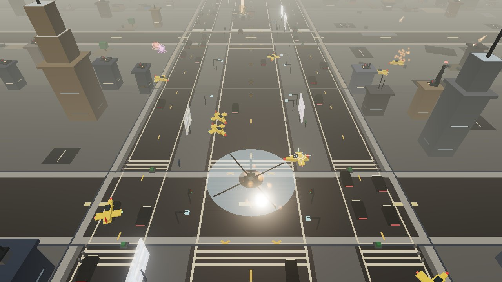
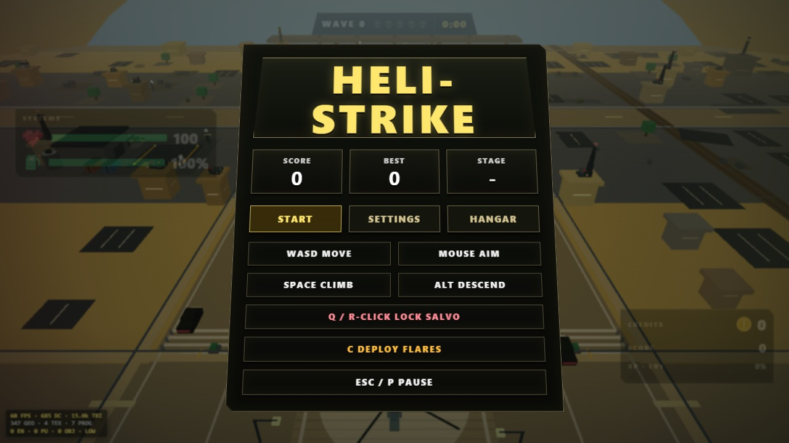
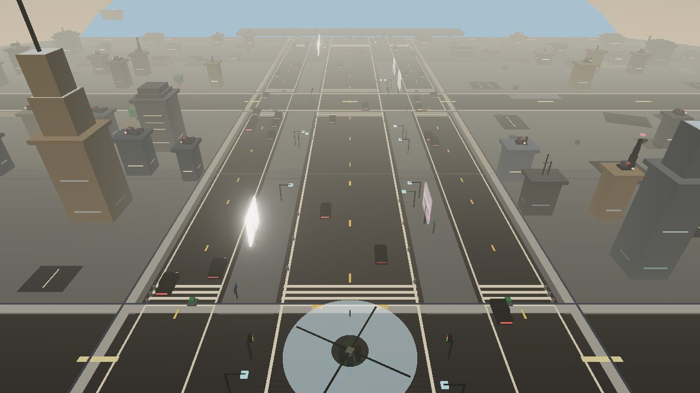
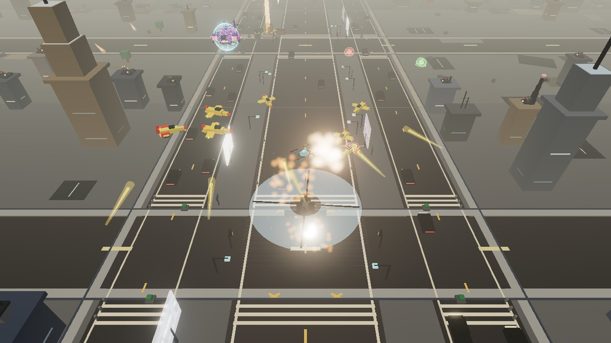

# 🚁 Heli-Strike Arcade Assault



> **A fast-paced, 3D low-poly arcade helicopter shooter.** Fly an advanced gunship over a living, procedural battlefield — dodge rooftop turrets, deliver high-risk cargo, complete tactical missions, deploy defensive flare countermeasures, raze enemy swarms, and topple colossal multi-phase bosses. Built with **React 19**, **Vite**, **Three.js**, and **Cannon-es**.

---

## 🖼️ Screenshots

| Main Menu | The Hangar |
| :---: | :---: |
|  |  |
| **High-Octane Combat & HUD** | **Colossal Boss Encounters** |
|  |  |

---

## ⚡ Core Features

### 🏙️ Living Procedural City
- **Dynamic Traffic Simulation**: Ground vehicles cruise along highways, swerve reactively, and honk if you fly too low.
- **Interactive Infrastructure**: Animated roadside billboards with scrolling marquee tickers, rooftop tracking gun turrets, pulsing radio beacons, and water towers.
- **Dynamic Weather System**: Procedural thunderstorms, volumetric rain particles, wind vectors, and dynamic lightning flash illumination.
- **Full Rigid-Body Destructibility**: Realistic collision physics for city buildings, debris scattering, camera shake, and hit-stop impact effects.

### 🎯 Tactical Missions & High-Risk Deliveries
- **Dynamic In-Run Missions**: Randomly assigned combat objectives (e.g. *Destroy SAM Batteries*, *Eliminate High-Value Targets*, *Recon Patrols*) with bonus rewards.
- **Cargo Delivery Contracts**: Transport heavy cargo (Aviation Fuel, Ammo Crates, Repair Parts) between pickup depots and dropoff zones. Cargo weight realistically influences helicopter inertia and aerodynamics.
- **Air Defense & Countermeasures**: Evade surface-to-air missile (SAM) batteries and deploy thermal **Flares** (`C` key) to decoy incoming lock-on missiles.

### 💥 Floating Combat Feedback & Visual Juice
- **3D Projected Floating Text**: Real-time floating damage numbers, critical hit badges, combo counters, and XP pickups projected from 3D world coordinates.
- **Dual Visual Modes**:
  - **SP1 Mode (Retro)**: Authentic PS1-style low-resolution rendering, pixelated textures, direct color quantization.
  - **HD Mode (Modern)**: Crisp high-DPI rendering, 4x MSAA, post-processing bloom, and advanced lighting.

### 🛠️ Weapon Mastery & The Hangar
- **Four Distinct Weapon Types**:
  - 🔴 **Machine Gun**: High-velocity twin-linked tracer rounds.
  - 🟢 **Homing Missile**: Heat-seeking warheads with wide blast radius.
  - 🟠 **Heavy Rocket**: Devastating explosive unguided rockets.
  - 🟡 **Combat Shotgun**: Wide-spread multi-pellet close-quarters blast.
- **Permanent Hangar Progression**: Upgrade 8 core ship systems (Engine, Rotor, Armor, Airframe, Fuel Efficiency, Targeting Computer, Weapon Reserves, Countermeasures) with earned Credits.
- **Aircraft Selection**: Choose between the balanced **AH-64 Apache**, agile stealth **F-117 Nighthawk**, and heavily armored **Mil Mi-24 Warlock**.
- **Multi-Salvo Target Lock**: Hold `Q` or `Right-Click` to paint up to 6 simultaneous targets and unleash a swarm barrage.

### 👾 Escalating Waves & Boss Cadence
- **Vampire-Survivors Style Progression**: Enemies drop XP gems on death to level up run stats through a 3-choice roulette.
- **Intelligent Enemy AI**: Enemies feature aim leading, line-of-sight building obstruction checks, flanking maneuvers, and kamikaze dives.
- **Mini-Bosses & Major Bosses**: Elite minibosses arrive every 5th wave, followed by a colossal three-phase gunship boss on Wave 10, complete with telegraphed laser volleys and escort squads.

---

## 📊 Armory & Specifications

| Weapon | Base Dmg | Fire Rate | Ammo | Payload Details |
|---|---|---|---|---|
| 🔴 **Machine Gun** | 13 | 0.055s | 300 | Twin-linked tracers · Rank 5: Tracer Rounds (+25% DMG) |
| 🟢 **Missile** | 55 | 0.950s | 20 | Homing · 16-radius blast · Rank 5: Twin Salvo |
| 🟠 **Rocket** | 80 | 1.450s | 12 | 28-radius blast · Rank 5: Napalm Warheads |
| 🟡 **Shotgun** | 10/pellet | 0.450s | 40 | 6-pellet spread · Rank 5: Slug Burst (+15% DMG) |

---

## 🕹️ Controls

### ⌨️ Desktop (Keyboard & Mouse)

| Action | Keybinding |
|---|---|
| **Move Helicopter** | `W`, `A`, `S`, `D` or `Arrow Keys` |
| **Climb / Descend** | `Space` / `Alt` |
| **Aim Crosshair** | `Mouse Movement` |
| **Fire Primary Weapon** | `Left Click` |
| **Multi-Salvo Target Painter** | `Q` or `Right Click` (Hold to paint) |
| **Deploy Flares (Countermeasures)** | `C` |
| **Afterburner (Boost)** | `Shift` (Burns extra fuel) |
| **Switch Weapons** | `1`, `2`, `3`, `4` |
| **Manual Reload** | `R` |
| **Pause / Menu** | `Esc` or `P` |

### 📱 Touch & Mobile Devices
- **Left Virtual Stick**: Helicopter flight & directional maneuvering.
- **Right Virtual Stick**: 360° twin-stick turret aiming & auto-fire.
- **Dedicated Buttons**: Fire, Salvo, Flares, Afterburner, and Weapon Wheel.

---

## 🚀 How to Run Locally

### Prerequisites
- **Node.js**: v20+ 
- **Package Manager**: npm, yarn, or pnpm

### Setup Instructions

1. **Clone the repository:**
   ```bash
   git clone https://github.com/ArnavNah/Heli-Copy.git
   cd Heli-Copy
   ```

2. **Install dependencies:**
   ```bash
   npm install
   ```

3. **Start local development server:**
   ```bash
   npm run dev
   ```
   *Open [http://localhost:3000](http://localhost:3000) (or the specified terminal port) in your browser.*

4. **Run Unit & Integration Tests:**
   ```bash
   npm test
   ```

5. **Type Check & Linting:**
   ```bash
   npm run lint
   ```

6. **Build for Production:**
   ```bash
   npm run build
   npm run preview
   ```

---

## 🗂️ Project Architecture

```
Heli/
├── screenshots/         # High-resolution gameplay, HUD, menu & boss screenshots
├── src/
│   ├── game/            # Modular game engine & subsystems
│   │   ├── engine.ts    # GameEngine: Core loop, physics tick, wave director
│   │   ├── entities.ts  # Helicopter, Enemy classes, Bosses, Projectiles
│   │   ├── city.ts      # Procedural city generation, traffic AI, billboards
│   │   ├── mission.ts   # Tactical mission generation, tracking, rewards
│   │   ├── delivery.ts  # Cargo delivery contracts, pickup/dropoff physics
│   │   ├── sam.ts       # Surface-to-Air missile batteries & lock-on logic
│   │   ├── props.ts     # Destructible world props, rooftop turrets, radar
│   │   ├── floatingText.ts # 3D projected damage text & combat notifications
│   │   ├── particles.ts # GPU particle systems, weather, volumetric FX
│   │   ├── materials.ts # Custom low-poly shaders, materials & geometries
│   │   ├── logic.ts     # Pure mathematical functions & stats calculation
│   │   ├── types.ts     # TypeScript interfaces, enums, weapon definitions
│   │   └── *.test.ts    # Vitest suites (14 files, 230+ automated tests)
│   ├── audio.ts         # Synthesized Web Audio API sound generator & music
│   ├── App.tsx          # React HUD, Hangar, Menus, Mobile Controls & UI
│   ├── index.css        # Arcade neon styling, HUD scanlines, Tailwind
│   └── main.tsx         # Application entry point
├── CHANGELOG.md         # Full development & version history
├── PROJECT_DETAILS.md   # Comprehensive systems design & API specifications
├── package.json         # Project dependencies and npm scripts
└── vite.config.ts       # Vite & Vitest configuration
```

---

## 📜 License

This project is open source and available under the **MIT License**.
