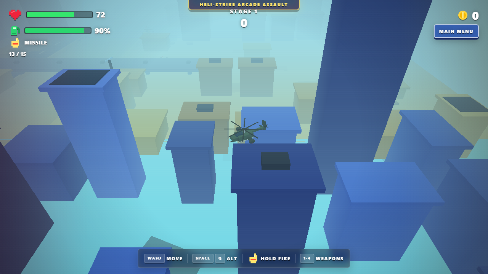
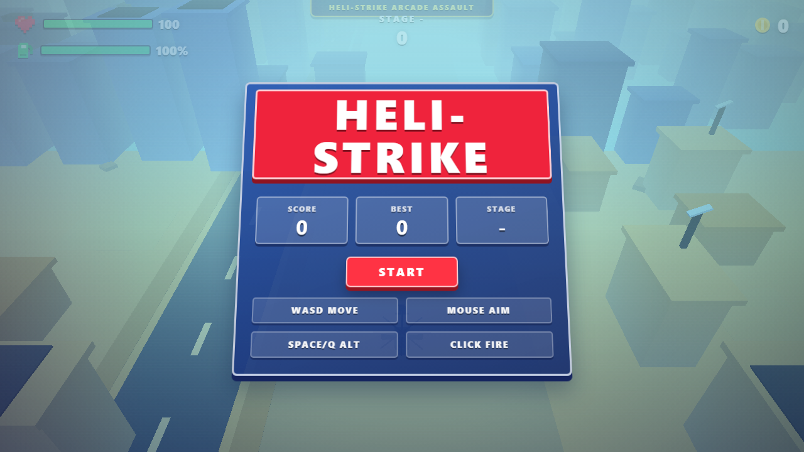
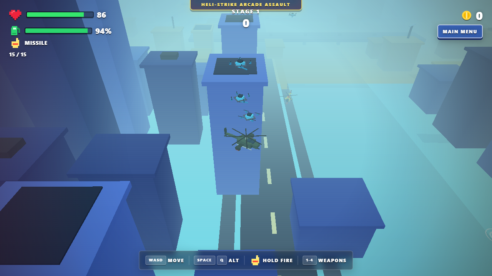

# Heli-Strike Arcade Assault



A fast-paced, 3D low-poly arcade helicopter shooter built with React, Vite, Three.js, and Cannon-es. Survive endless waves of enemies, collect power-ups, and rack up high scores!

## Features

- **Intense 3D Action**: Fly a military helicopter over procedurally generated cities, deserts, and forests.
- **Multiple Weapons**: Switch between Machine Guns, Missiles, Rockets, and Shotguns to obliterate your enemies. Each weapon levels up as you get kills, and leveling up opens a **pick-1-of-3 upgrade roulette** (damage, fire rate, ammo, shields, and more).
- **Dynamic AI**: Face off against drones, tanks, shooters, elite minibosses (every 5th wave), and a multi-phase boss with telegraphed attacks.
- **Time-Driven Waves (Vampire-Survivors style)**: Waves advance on a clock, never on clearing the field — enemies stream in forever, ramping density and spawning from flanks and behind to surround you. Survival time is the real score.
- **Living City**: A wide procedural city with streaming blocks, **moving traffic** that swerves away and honks when you buzz it, **animated roadside billboards** with scrolling marquee tickers, **rooftop gun turrets** that track and shoot you, and pulsing rooftop beacons — a battlefield that feels alive.
- **Enemy Modifiers**: Shielded enemies absorb hits, regenerating tanks heal over time, and enemies adopt attack patterns — circle-strafing runs, kamikaze dives, and arcing artillery shells.
- **Destroyable Objectives**: SAM sites boost enemy fire while alive, radar towers hit the whole field with an EMP, and ammo depots drop screen-clearing bombs. Take them out to shift the battle.
- **Power-Up System**: Fly over defeated enemies to collect Health, Fuel, Ammo, Damage Boosts, Shields, Speed Boosts, and Screen-clearing Bombs!
- **Kill Confirmations**: Rack up multi-kills for DOUBLE / TRIPLE / QUAD KILL announcements, slow-mo moments, and a visible combo-expiry bar.
- **Risk/Reward**: Hold `Shift` for an afterburner that burns fuel for speed and damage — or fight at low health to earn a **Risky Rendezvous** score multiplier (up to x1.75).
- **Weapon Mastery & Hangar**: Weapon levels persist across runs. Reach rank 5 with a weapon to unlock its signature alt-fire (tracer rounds, twin salvo, napalm warheads, slug burst) — browse them in the Hangar screen.
- **Procedural difficulty curve**: Enemy HP grows +18%/wave, shot damage +7%/wave and fire rate +4%/wave (all capped), so wave 20 is measurably deadlier than wave 2 regardless of the selected difficulty.
- **Boss battles every 10th wave**: A full three-phase boss (new attack at 66%/33% HP, telegraphed beam volleys, radial bursts) with an escort squad — scaled by the wave curve and difficulty. Elite minibosses still hit every other 5th wave.
- **Playable Aircraft**: Pick your ride in the Hangar — the balanced **Apache**, the angular stealth **Nighthawk**, or the heavy-gunship **Warlock**. Your choice persists across runs.
- **Auto-Aim (Settings)**: Toggleable gun tracking — the chin gun turret locks onto and tracks the nearest enemy while the helicopter keeps flying on course (the body no longer swings toward the crosshair).
- **Difficulty Selector**: Casual / Normal / Hard scales enemy HP, damage, swarm density, and the risky-score ceiling.
- **Objective Markers**: Active SAM sites, radar towers, and ammo depots are marked with beacons and floating labels so you can find them from the air.
- **Building Collisions & Crashes**: Fly into a building and you'll pay for it — slow scrapes cost a little (sparks + wobble), full-speed slams deal heavy damage with a debris explosion, hit-stop, camera shake, an out-of-control helicopter wobble, and a lingering smoke column at the impact site.
- **Weather & Physics**: Experience thunderstorms, rain, and realistic rigid-body physics for explosive combat.
- **Pause & Settings**: Hit `Esc`/`P` to pause, tweak sensitivity, inverted-Y, volume, and visual quality (bloom FX) anytime.
- **Mobile Twin-Stick**: On touch devices you get virtual joysticks and a fire button — no keyboard needed.
- **Run Stats**: The game-over screen reports survival time, kills, max combo, and accuracy.

## Screenshots

### Main Menu


### High-Octane Combat


## How to Run Locally

**Prerequisites:** Node.js v20+

1. Install dependencies:
   ```bash
   npm install
   ```
2. Start the development server:
   ```bash
   npm run dev
   ```
3. Run tests:
   ```bash
   npm test
   ```

## Controls

### Desktop

- **W, A, S, D / Arrows**: Move Helicopter
- **Mouse**: Aim crosshair
- **Left Click**: Fire weapon
- **Q / Right Click**: Lock-on Multi-Salvo
- **Shift**: Afterburner (burn fuel for speed + damage)
- **Space**: Climb · **Alt**: Descend
- **WASD-only flight**: the helicopter moves only while keys are held — release the keys and it settles into a gentle idle hover
- **1, 2, 3, 4**: Switch weapons (Machine Gun, Missile, Rocket, Shotgun)
- **R**: Reload
- **Esc / P**: Pause / Resume

### Touch Devices

- **Left stick**: Move
- **Right stick**: Aim (deflect to fire)
- **FIRE button**: Fire

## Project Structure

```
src/
  game/          # Split game engine modules
    engine.ts    # GameEngine — main loop, input, AI director, waves
    entities.ts  # Helicopter, Enemy, Projectile, PowerUp, ProjectilePool
    city.ts      # CityEnvironment — procedural city generation
    particles.ts # Rain, weather, GPU particles, volumetric explosions
    materials.ts # Shared shaders + mesh/material factories
    types.ts     # Enums, shared types, weapon configs
    logic.ts     # Pure, unit-tested game logic
    logic.test.ts
  audio.ts       # Synthesized Web Audio SFX + chiptune music
  App.tsx        # HUD, menus, pause/settings, touch controls
```
